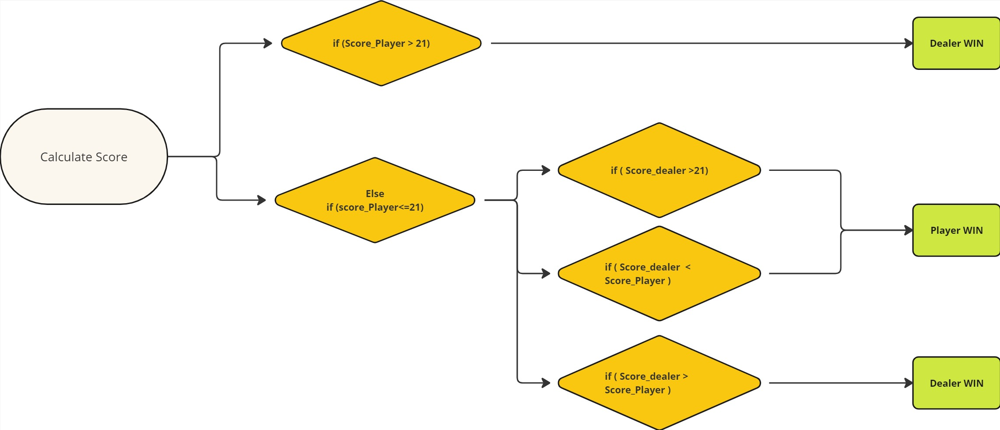

(Example of Rule-Set By Ichrak BENAMMAR  )
# The basic rules of Blackjack 

## Objective:
The objective of Blackjack is to beat the dealer by either:
-	Getting a hand total closer to 21 than the dealer's hand.
## Card Values:
-	Number cards (2 through 10) are worth their face value.
-	Face cards (Jack, Queen, King) are worth 10 points each.
-	Aces can be worth either 1 or 11 points, depending on which value benefits the player more.
## Gameplay:
-	Each player is dealt two cards face-up, while the dealer receives one card face-up and one card face-down.
-	Players can then choose to:
	    -   Hit: Request another card to be dealt.
	    -   Stand: Keep their current hand and end their turn.
-	The dealer then reveals their face-down card.
-	The dealer must hit until their hand reaches at least 17 points.
## Winning and Losing:
-	If a player's hand total exceeds 21, they bust and lose!
-	If a player's hand total is closer to 21 than the dealer's hand total without exceeding 21, the player wins!
-	If the dealer busts, all remaining players win.

## Example

- Player's Hand: Jack of Hearts, 7 of Diamonds (Total: 17)
- Dealer's Hand: Ace of Spades, 5 of Clubs (Total: 6, assuming Ace counts as 11)

Player decides to stand with a total of 17.
Dealer reveals their face-down card, an Ace.
Dealer hits and draws a 10 of Hearts (Total: 16).
Dealer hits again and draws a 9 of Diamonds (Total: 25, bust).
Player wins because the dealer busts.

Miro Diagram to explain the winner determination

